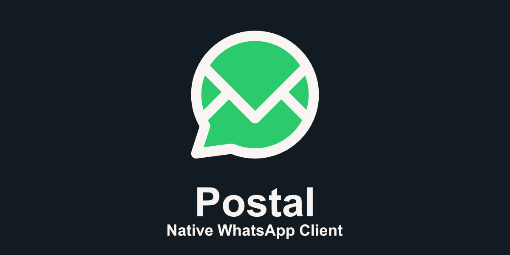

# Postal



A native WhatsApp desktop client. It speaks the WhatsApp multi-device protocol
directly instead of embedding WhatsApp Web in a browser engine.

## Why

The obvious way to build a WhatsApp desktop client is to wrap WhatsApp Web in a
webview, which is what Altus (and most alternatives) do. That approach has a
cost: WhatsApp Web treats a desktop client like another browser tab, so it syncs
the account's **entire message history** into local storage and then keeps it in
memory. On a large account that means tens of gigabytes downloaded, multi-
gigabyte memory use, and a client that gets slower the more history you have.

Postal takes the other path. Because it implements the protocol itself:

- **History sync is a decision this program makes.** Pairing brings the recent
  window only unless *Settings → Storage & history → Request full history when
  pairing* is on (off by default). This requests up to 10,000 days; the phone
  may supply less. Older messages can also be fetched on demand.
  Sync requests never change disk retention. Legacy full-history settings
  migrate to explicit unlimited global disk retention, preserving their effect.
- **Disk history and RAM have separate limits.** SQLite is a durable archive,
  unlimited on new installations unless explicit disk retention is configured.
  Existing disk policies survive upgrades. The open conversation keeps a bounded
  `MessageWindow` (500 messages by default, adjustable from 50 to 2,000).
  Older/newer pages come from SQLite; only exhausted local history asks the phone.
  Eviction from RAM never deletes disk rows. Back to latest returns to live messages.
  History can also be cleared, or kept in memory only.
  Disk retention deletes expired messages strictly, including a quiet chat's
  last message. Chat identity, last activity, names and pins survive separately;
  an empty chat has no retained message preview. Delete chat removes it from the
  list; clearing history keeps chat metadata.

- **No browser engine for WhatsApp.** No WebKit, no per-tab network processes,
  no compositing workarounds. The only webview is the one rendering this app's
  own UI.

Retention limits use explicit `limited`, `unlimited` and per-chat `inherit`
states. Existing numeric settings and per-chat overrides migrate without changing
their disk policy. A limited count of zero means retain no messages; unlimited
is a separate state. Global settings cannot inherit.

## Measured impact

Historical measurements with bounded disk retention, comparing the old webview
approach with this one. These are not measurements of unlimited archive mode:

| Metric | Altus (WhatsApp Web in a webview) | Postal |
| --- | --- | --- |
| CPU, idle | ~200% of one core, sustained | **~0.3%** |
| Memory, whole app | ~2.2 GB, climbing to ~23 GB | **~600 MB** |
| History downloaded at pairing | entire account (~20 GB) | none |
| Message history stored | 604k+ rows, 774 MB | bounded by retention |

Memory is the whole app. The protocol core is around 35 MB; the rest is the one
WebKit webview that renders the UI, the only place a browser engine is used. The
message window is now bounded separately. An unlimited SQLite archive can grow
on disk; these measurements do not establish its maximum size or query latency.

CPU was sampled with `pidstat` in 30-second windows. Altus held 130-220% of one
core the entire time and its RSS kept climbing toward the full 23 GB history, so
it never reaches a true idle. Postal sits under 1% when idle.

This is not a knock on Altus. It is a good project, and a fairly optimized one;
the numbers above are a property of the approach, not of its authors. Any client
that drives WhatsApp Web inherits the web app's behaviour: it has to pull the
account's history in, and it has to keep the page holding that history alive.

The session database also needed bounding: decryption secrets for edits and
reactions default to a 30-day horizon, which grew one profile to 97 MB across
399,620 rows. The horizon now tracks the message retention window, and existing
profiles are reclaimed on startup (**97 MB → 5.8 MB**).

## The name

**Postal** is the service that carries a letter from one person to another:
it takes what you wrote, routes it, and hands it over intact. A chat client
does the same with messages, one delivery at a time. More in
[docs/name.md](docs/name.md).

## Architecture

```
crates/postal-core/    protocol client, storage, retention
  history.rs            which history-sync chunks to accept
  store/                SQLite repository and explicit DiskRetentionManager
  service.rs            connection lifecycle, typed event stream
src-tauri/              Tauri shell: commands and event forwarding
src/                    Svelte 5 UI (chat list, conversation, pairing)
```

`postal-core` is built on [`whatsapp-rust`](https://github.com/oxidezap/whatsapp-rust),
a pure-Rust implementation of the WhatsApp multi-device protocol.

Service database calls use `StoreWorker`/`AliasWorker`: an async gate queues callers
before `spawn_blocking` runs SQLite. Reads and writes share one connection per
service. Live/history batches hold an exclusive lease through their savepoint;
background downloads and other callers wait without occupying Tokio workers.
Cancellation lets an already-started write finish before releasing the savepoint
and lease. Network requests remain async and do not run in the blocking pool.

One connection preserves batch ordering and avoids cross-connection cache and
transaction rules. A large query can delay another database request, but cannot
stall unrelated async tasks. Add separate read connections only if measured read
latency warrants them. The optional Android companion owns its own connection;
SQLite coordinates those connections through WAL and its busy timeout. Synchronous
`MessageStore` remains available for startup migrations, CLI tools and tests;
async callers must use the worker boundary.

## Installing

Releases ship an AppImage. Download it from the releases page, or run:

```console
curl -fsSL https://raw.githubusercontent.com/emiliano-go/postal/master/scripts/install.sh | sh
```

The installer pins the release tag and checks the AppImage against the release's
`SHA256SUMS` and GitHub's own digest before replacing anything; set
`POSTAL_VERSION=v0.1.0` to install a specific release.

## Building

To build from a clone:

```console
scripts/install-dev.sh          # build a release and install it
scripts/install-dev.sh --dev    # start the dev server
```

The release bundles, AppImage included, are built with `scripts/build-release.sh`,
which sets the two environment variables the AppImage tooling needs on current
distros, and leaves the files to upload (AppImage, icon, `SHA256SUMS`) in
`dist/`. `install-dev.sh` never bundles, so it does not run into them.

Dependencies are declared in `Cargo.toml`: Tauri comes from crates.io, and
`whatsapp-rust` is pinned to a git revision because per-chunk history control
(`HistorySyncAdmission`) is newer than its last release. Cargo fetches both, so
there is nothing to clone by hand. `.cargo/config.toml` has Cargo use the system
`git`, so a global HTTPS-to-SSH rewrite still works.

Requirements: Rust 1.94+ (stable), Node with pnpm, and the usual Tauri Linux
dependencies (WebKitGTK 4.1, GTK 3). The dev script does not install system
packages; it prints what the build needs.

On Wayland, WebKitGTK's DMA-BUF renderer fails with `Gdk Error 71`. The app sets
`WEBKIT_DISABLE_DMABUF_RENDERER=1` itself, so no manual configuration is needed.

## Diagnostics

Settings → About → Server feature flags shows watched boolean A/B properties,
their registry defaults and their last received server values. Refresh reads the
local cache; Watch checks it every five seconds while the panel is open.
"Not received" is distinct from false. Postal currently exposes these flags for
diagnostics without using them to gate product features.

New links pair as an ordinary External companion. Settings → Device can add an
Android companion: a second link that pairs as an `ANDROID_TABLET` running
WhatsApp Android `2.26.32.84`, published on the [official download page](https://www.whatsapp.com/download)
when checked on 2026-09-27, to receive the one-time photos, videos and voice
notes the External link never gets. Pairing is its own short step, and the
companion can only be enabled once linked. It shares the message store, wakes
when a one-time message arrives, fetches it, and goes dormant again.

The companion's handshake sets Android metadata (`ANDROID`, device `Tablet`,
Android `13`) and omits browser `WebInfo`. This is the library's supported
profile: transport remains the Web companion socket, with its separate
three-part protocol version. Full native Android transport and a four-part
handshake version require upstream support.

Two binaries exercise the core without the UI:

```console
cargo run -p postal-core --bin spike          # pair by QR, print a terminal QR
cargo run -p postal-core --bin service-check  # store messages, show retention
```

`spike` renders its pairing code as Unicode blocks, so it needs no image viewer.
Set `SPIKE_HISTORY=accept` to compare behaviour when the full history is allowed.

The app itself logs to `postal.log` in its data directory (*Settings → About →
Open log*): connection changes, sync progress, per-batch timings, failed store
writes, failed UI commands and crashes with a backtrace. `RUST_LOG` overrides
the levels; past 5 MB the file moves to `postal.log.old`.

Tolerated database and media-cache failures use the `postal_core::storage`
error target with the calling source location. Missing message rows are normal
and stay quiet. Malformed protocol messages still skip without stopping the
event loop. Broadcast sends without subscribers are expected during shutdown;
Tauri event-emission failures and lagged consumers are logged separately.

## Media

Right-click an image for **Copy Image**, **Save Image…**, or **Open Image**.
Save uses the native file picker and preserves the original file. Copy places
decoded image pixels on the clipboard. Other attachments offer Save and Open.
Missing files download on demand; deleted and unkept one-time messages cannot be
exported. One-time media kept by the Android companion follows ordinary
attachment actions.

Downloaded media is written to the folder set in Settings, which defaults to the
app data directory. The asset protocol is scoped to whatever folder is
configured, so a custom location is served to the UI as well.

Attachments are read in the webview and sent base64-encoded, because a webview
cannot hand out a real filesystem path. That is fine for the images and
documents a picker is normally used for, but it is not a good fit for very large
files.

## Security

- The UI runs under a content security policy: scripts only from the app, no
  remote fonts, images or connections. Media uses explicit asset, blob and data
  sources. Inline styles remain allowed for Svelte and user themes; inline
  scripts and eval are not allowed. Development additionally allows the local
  Vite server and its reload websocket.
- Link previews for messages you send are fetched by the app, from public
  HTTP(S) addresses only (checked after DNS resolution at connect time, including
  redirects and preview images). Remote sites see your device's request and
  public IP. Previews are skipped when an HTTP proxy is configured because its
  target resolution cannot be verified locally; Postal does not bypass it.
- CSS extensions are trusted local customization: they can restyle or hide
  anything. Sanitization only prevents closing the surrounding `</style>` tag;
  it does not make CSS safe or prevent resource loads. The CSP blocks remote
  loads, while resources allowed by that policy remain accessible to CSS.

## Testing

```console
cargo test -p postal-core
pnpm check
node --experimental-strip-types src/lib/format.ts
node --experimental-strip-types src/lib/phone.ts
```

## Status

Working:

- Pairing by QR or re-signing in with the stored session; several accounts,
  switchable from the account menu
- Text with WhatsApp formatting, mentions, replies and quotes, edits, deletes,
  forwards, reactions, stars and pinned messages and chats
- Images, video, GIFs, stickers, documents and voice notes: received inline,
  sent from the composer, played in place; view-once media kept through the
  optional Android companion
- Polls and events, including voting and RSVPs
- Link previews as Discord-style embeds; locations and contacts as cards
- Delivery and read receipts, message info, typing and presence
- Group info with member tags and admin reports, profiles, privacy settings
- A mentions inbox, starred messages and search within a chat
- Retention with per-chat overrides, clearing history, in-memory-only history,
  on-demand download of older messages
- Themes (Dark, Light, Midnight, Liquid Glass, Material 3), a theme editor with
  live previews, CSS extensions, background pictures per app or per chat,
  density, text size and animation settings

Not yet: calls, desktop notifications, the tray icon, status updates,
communities and channel management, broadcast lists and albums. The issue
tracker has the details.

## License

MIT, see [LICENSE](LICENSE). Third party dependencies keep their own
licenses, listed in [THIRD_PARTY_NOTICES.md](THIRD_PARTY_NOTICES.md).
